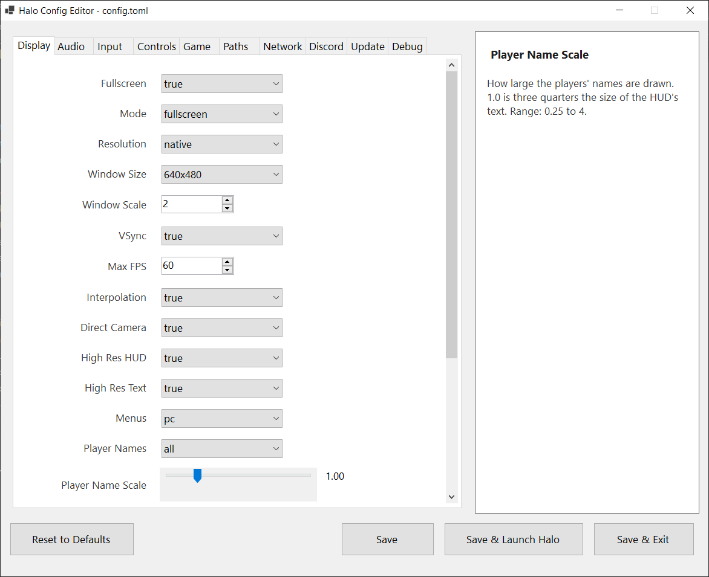

# Halo Config Editor


**Halo Config Editor** is a portable Windows application for editing the `config.toml` file used by Halo: Combat Evolved decompilation ports like OpenCE projects. It provides a dedicated graphical interface for configuration settings, so you can customize your setup without manually editing TOML or using console commands.

Place the editor beside your configuration file and Halo executable, make your changes, and launch the game from the same folder.



## Table of Contents

- [Features](#features)
- [Installation](#installation)
- [Usage](#usage)
  - [Editing Settings](#editing-settings)
  - [Changing Key Bindings](#changing-key-bindings)
  - [Configuring the Scoreboard Colour](#configuring-the-scoreboard-colour)
- [Configuration File Handling](#configuration-file-handling)
- [Building from Source](#building-from-source)
- [Project Structure](#project-structure)
- [Contributing](#contributing)
- [Acknowledgements](#acknowledgements)
- [Disclaimer](#disclaimer)

## Features

- **Ten organized tabs** for Display, Audio, Input, Controls, Game, Paths, Network, Discord, Update, and Debug.
- **Typed setting editors** for booleans, integers, floating-point values, dropdowns, sliders, key bindings, resolutions, and colours.
- **Keyboard and mouse input capture** for key bindings, including mouse buttons and scroll-wheel directions. `Tab`, `Enter`, `Escape`, and arrow keys can be captured without changing focus.
- **Scoreboard colour picker** with RGB selection and a separate alpha slider from `0` (transparent) to `255` (opaque).
- **Contextual documentation panel** that displays the port's setting documentation when you hover over a setting.
- **Reset to Defaults** to restore the documented defaults, with a confirmation step.
- **Conservative configuration handling** that retains unknown sections and keys.
- **Comment-aware descriptions** that use configuration comments to populate setting information.
- **Portable single-file release** with no installer or separate runtime installation required for the self-contained build.

The editor makes advanced port settings easier to manage, including high-resolution HUD rendering, per-pixel lighting, MSAA/SSAA antialiasing, higher interpolated frame rates, network options, and debugging settings.


## Installation

### Portable Release (Recommended)

1. Download the latest `HaloConfigEditor.exe` from the repository's [Releases](../../releases) page.
2. Copy the executable into the folder containing your `config.toml` and the decompiled Halo executable.
3. Run `HaloConfigEditor.exe`.

The editor will load the `config.toml` in its folder, save changes back to that file, and launch the Halo executable from the same folder when you choose **Save & Launch Game**.

### Requirements

- Windows 10 or Windows 11 (64-bit).
- No additional installation is required for the self-contained, single-file release.

If you build from source or use a framework-dependent build, install the [.NET 8 Desktop Runtime](https://dotnet.microsoft.com/download/dotnet/8.0).

## Usage

### Editing Settings

1. Start the editor from the folder containing the configuration file.
2. Select a tab to view related settings.
3. Change values using the appropriate controls. Changes are applied to the editor's in-memory configuration.
4. Hover over a setting to view its documentation in the information panel.
5. Use one of the actions at the bottom of the window:

| Action | Description |
|---|---|
| **Save** | Saves the current settings to `config.toml` and leaves the editor open. |
| **Save & Launch Game** | Saves the configuration and starts the Halo executable in the same folder. |
| **Save & Exit** | Saves the configuration and closes the editor. |
| **Reset to Defaults** | Restores the port's documented defaults after confirmation. |

### Changing Key Bindings

1. Open the **Controls** tab.
2. Select **Change Keybind** next to the action you want to change.
3. Press a keyboard key, click a mouse button, or scroll the mouse wheel.
4. The captured input is assigned to that action.

Examples of supported inputs include `W`, `Space`, `Left Ctrl`, `F1`, `Mouse Left`, `Mouse 4`, `Wheel Up`, and `Wheel Down`.

### Configuring the Scoreboard Colour

1. Find **Scoreboard Colour**.
2. Click the colour swatch to open the Windows colour picker and choose an RGB colour.
3. Adjust the **Alpha** slider, or its numeric value, to set transparency from `0` to `255`.
4. Save your changes. The colour is written to `config.toml` in `R, G, B, A` form.

## Configuration File Handling

Halo Config Editor is designed to preserve the structure and contents of your configuration as much as possible.

- **Key order is retained.** Existing keys are written back in the order they were first encountered and under their original section headers.
- **Unknown sections and keys are preserved.** Custom entries that the editor does not expose remain in the file.
- **Comments provide documentation.** Comments above settings can be used to populate the information panel. When saving, the file is rewritten using the editor's normal formatting, so handwritten comments may not be preserved exactly.
- **TOML values are serialized by type.** Strings are quoted, numbers and booleans are unquoted, and arrays are written inline.

For example, a configuration file may contain settings like these:

```toml
config_version = 2

[display]
fullscreen = true
mode = "fullscreen"
resolution = "native"
max_fps = 60
anti_aliasing = "msaa2x"

[controls]
move_forward = "W"
fire = "Mouse Left"
pause = "Escape"

[network]
online = true
tunnel_port = 0
```

The exact available settings depend on the Halo port and configuration file you use.

## Building from Source

### Prerequisites

Choose one of the following development environments:

- Visual Studio 2022 with the **.NET desktop development** workload, or
- The .NET 8 SDK. Verify the installation with `dotnet --version`.

### Clone and Run

```bash
git clone https://github.com/Stojanovic94/HaloConfigEditor.git
cd HaloConfigEditor
dotnet run
```

Alternatively, open `HaloConfigEditorApp.sln` in Visual Studio and press **F5**.

> Replace `Stojanovic94` in the clone URL with the GitHub account or organization that hosts the repository.

### Publish a Single-File Executable

Run:

```bash
dotnet publish -c Release -r win-x64 -p:PublishSingleFile=true
```

The published files are placed in:

```text
bin\Release\net8.0-windows\win-x64\publish\
```

For a self-contained single-file release from Visual Studio:

1. Right-click the project and select **Publish**.
2. Choose **Folder** as the target.
3. Set the deployment mode to **Self-contained**.
4. Set the target runtime to **win-x64**.
5. Enable **Produce single file**.
6. Select **Publish**.

## Project Structure

```text
HaloConfigEditorApp/
├── Program.cs                  # Application entry point
├── Form1.cs                    # UI logic, configuration I/O, and key capture
├── Form1.Designer.cs            # Main form layout
├── Settings.cs                  # SettingBinding and SettingDefinition records
├── SettingInfo.cs               # Setting descriptions for the information panel
├── HaloConfigEditorApp.csproj   # Project file
└── config.toml                  # Sample configuration used during development
```

### Design Notes

- **Data-driven UI:** Settings are represented by `SettingDefinition` records. Adding a setting involves updating `BuildTabs()` and adding its description to `SettingInfo.cs`.
- **Designer-friendly layout:** The outer form layout is maintained in `Form1.Designer.cs`, while setting rows are generated at runtime.
- **Portable paths:** File paths are resolved relative to `Environment.ProcessPath`, allowing the executable to run from different folders.

## Contributing

Issues and pull requests are welcome.

- **Missing setting:** Open an issue and include the relevant TOML snippet from the default `config.toml` of the port version you are using.
- **New editor type:** Extend the relevant switch in `CreateSettingRow` and the corresponding switch in `InitializeControlsFromValues`.
- **Setting documentation:** Update `SettingInfo.cs` to change the information shown in the documentation panel.

Before submitting a pull request, build the project in Release mode:

```bash
dotnet build -c Release
```

The project is configured to use nullable reference types.

## Acknowledgements

- The Halo decompilation community, including contributors to OpenCE and related reimplementation projects.
- The maintainers of the Halo port for documenting the available `config.toml` settings.
- Everyone who has ever had to hand-edit a configuration file late at night.

## Disclaimer

Halo Config Editor is an unofficial community tool. It is not affiliated with, endorsed by, or sponsored by Microsoft, Bungie, 343 Industries, the Halo decompilation project, or the OpenCE maintainers.

Halo: Combat Evolved is a trademark of Microsoft Corporation. This editor reads and writes a plain-text configuration file; it does not include, distribute, or reverse-engineer the game itself. You must own a legally obtained copy of Halo: Combat Evolved Xbox version to use the game port this tool is designed for.
